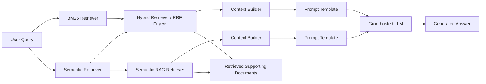

# DSCI_575_project_omo001_deepray

## Overview

**Smart Amazon Product Query Assistant** is a product search and question-answering system built on the **Amazon Reviews 2023** dataset. The project retrieves relevant Amazon product-review documents from natural-language queries and generates grounded answers using retrieved review evidence.

By the **final submission**, the system includes:

- **BM25** keyword-based retrieval
- **Semantic search** using sentence embeddings and vector similarity
- **Hybrid retrieval** combining BM25 and semantic retrieval with rank fusion
- **Retrieval-Augmented Generation (RAG)** for grounded product question answering
- **Prompt experimentation** across multiple prompt variants
- **Qualitative evaluation** of generated answers using accuracy, completeness, and fluency
- **Quantitative evaluation** using retrieval metrics such as precision@k and recall@k
- An improved interactive app supporting both **Search Only** and **RAG Mode**

The project initially explored two categories:

- **All_Beauty**
- **Health_and_Personal_Care**

After exploratory analysis, **All_Beauty** was selected as the primary category and retained throughout the retrieval and RAG workflow. The final system operates on a substantially scaled cleaned All Beauty dataset containing **701,092 records**, well above the project minimum requirement.

Example query types include:

> "fragrance-free moisturizer for sensitive skin"  
> "gentle makeup remover"  
> "skin care product for very dry lips in winter"

By combining lexical retrieval, semantic retrieval, hybrid ranking, and grounded answer generation, the project demonstrates how retrieval and generation can work together for product discovery, product comparison, and review-based question answering. The final submission also emphasizes reproducibility, improved documentation, code quality, and a practical cloud deployment plan.

## RAG Pipeline Workflow



### Workflow summary

The system supports two retrieval-and-generation paths:

1. Semantic RAG

- retrieves relevant documents with the semantic - retriever
- builds a structured context block
- sends the context and query to the LLM

2. Hybrid RAG

- retrieves documents with both BM25 and semantic retrieval
- combines rankings using weighted Reciprocal Rank Fusion (RRF)
- builds a structured context block from the fused results
- sends the context and query to the LLM

In both cases, the LLM is instructed to answer using only the retrieved review evidence.

## Project Goals

This project aims to:

- build a reproducible retrieval pipeline on Amazon review data
- compare **keyword-based**, **semantic**, and **hybrid** retrieval approaches
- build a grounded **RAG pipeline** for product question answering
- evaluate retrieval and answer quality qualitatively across different query types
- expose both retrieval-only and RAG workflows through a user-facing web app

## Major Repository Structure

```text
DSCI_575_project_omo001_deepray/
│
├── README.md
├── environment.yml
├── pyproject.toml
├── .gitignore
├── .env.example
│
├── data/
│   ├── raw/                        # downloaded Amazon files (gitignored)
│   └── processed/                  # cleaned datasets and saved retriever artifacts (gitignored)
│
├── notebooks/
│   ├── milestone1_exploration.ipynb
│   ├── milestone1_evaluation.ipynb
│   ├── milestone2_rag.ipynb
│   ├── final_llm_experiment.ipynb
│   └── final_evaluation.ipynb
│
├── app/
│   └── app.py
│
├── src/
│   ├── __init__.py
│   ├── bm25.py
│   ├── semantic.py
│   ├── hybrid.py
│   ├── rag_pipeline.py
│   ├── preprocessing.py
│   └── utils/
│       ├── __init__.py
│       ├── evaluation.py
│       ├── io.py
│       ├── preprocessing.py
│       └── retriever_loading.py
│
├── results/
│   ├── milestone1_discussion.md
│   ├── milestone2_discussion.md
│   └── final_discussion.md
│
└── scripts/
    ├── make_datasets.py
    ├── build_bm25_index.py
    └── build_semantic_index.py
```

## Dataset

This project uses the **Amazon Reviews 2023** dataset from McAuley Lab.

For Milestone 1, the project explores:

- `All_Beauty`
- `Health_and_Personal_Care`

The final retrieval pipeline for Milestone 1 uses the **All_Beauty** category:

- `All_Beauty.jsonl`
- `meta_All_Beauty.jsonl`

These files should be stored in `data/raw/` and should not be committed to Git.

## Milestone 2 Workflow

### 1. Data exploration and preprocessing

In `notebooks/milestone1_exploration.ipynb`, the project:

- inspects review and metadata records
- examines available fields and missingness
- compares candidate categories
- justifies the selected retrieval fields
- explains preprocessing decisions

The final processed retrieval dataset is built separately using `scripts/make_datasets.py`.

### 2. BM25 retrieval

The BM25 pipeline:

- tokenizes the document corpus
- preprocesses queries consistently with documents
- ranks documents by BM25 relevance score
- saves reusable BM25 artifacts to disk

### 3. Semantic retrieval

The semantic retrieval pipeline:

- generates dense sentence embeddings for retrieval documents
- indexes them with FAISS
- retrieves semantically similar results for natural-language queries
- saves reusable semantic retrieval artifacts to disk

### 4. Hybrid retrieval

The hybrid retriever:

- reuses BM25 and semantic retrieval outputs
- combines rankings using **weighted Reciprocal Rank Fusion (RRF)**
- removes duplicates across retrieval methods
- returns fused top-ranked documents for downstream use

### 5. RAG pipeline

The RAG pipeline:

- retrieves top-ranked supporting documents
- formats them into a structured prompt context
- applies one of several prompt variants
- uses a Groq-hosted Llama model to generate grounded answers

### 6. Qualitative evaluation

Milestone 2 evaluates generated answers manually on selected queries from Milestone 1 using:

- **Accuracy**
- **Completeness**
- **Fluency**

The exploratory notebook for this workflow is:

- `notebooks/milestone2_rag.ipynb`

The final written discussion is recorded in:

- `results/milestone2_discussion.md`

### 4. Qualitative evaluation

The project creates a diverse set of queries spanning easy, medium, and complex search intent, then compares BM25 and semantic retrieval on the same query set.

The evaluation workflow is documented in:

- `notebooks/evaluation.ipynb`

The final written discussion and observations are recorded in:

- `results/milestone1_discussion.md`

## Installation

### 1. Clone the repository

```bash
git clone https://github.com/UBC-MDS/DSCI_575_project_omo001_deepray
cd DSCI_575_project_omo001_deepray
```

### 2. Create and activate the conda environment

```bash
conda env create -f environment.yml
conda activate amazon-retrieval
```

### 3. Install the project in editable mode

```bash
pip install -e .
```

## Environment Variables

A `.env.example` file is provided in the project root. Copy it to `.env` and update the values before running the RAG pipeline or app.

**On macOS/Linux:**

```bash
cp .env.example .env
```

**On Windows PowerShell:**

```bash
Copy-Item .env.example .env
```

Then edit .env so it includes your Groq credentials and model selection:

```bash
GROQ_API_KEY=your_groq_api_key_here
GROQ_MODEL=your_default_groq_model_here
```

These variables are used by:

- `src/rag_pipeline.py`
- `notebooks/milestone2_rag.ipynb`
- `notebooks/final_llm_experiment.ipynb`
- `app/app.py` when running in RAG Mode

`GROQ_MODEL` controls the default model used for answer generation.

Never commit secrets to Git.

## Data Setup

Raw and sampled data files are managed with the project shell scripts.

### 1. Download raw category files

To download one or more Amazon Reviews 2023 category files into `data/raw/`, run:

```bash
bash src/scripts/download_data.sh <Category1> [Category2 ...]
```

Example:

```bash
bash src/scripts/download_data.sh All_Beauty Health_and_Personal_Care
```

This downloads both the review and metadata files for each category into `data/raw/`.

### 2. Re-download existing raw files

If the raw files already exist and you want to download them again, use `--force`:

```bash
bash src/scripts/download_data.sh --force <Category1> [Category2 ...]
```

Example:

```bash
bash src/scripts/download_data.sh --force All_Beauty
```

### 3. Create sampled files for EDA

To create sampled JSONL files from the raw data for lightweight exploration, run:

```bash
bash src/scripts/create_samples.sh <DatasetName1> [DatasetName2 ...]
```

Example:

```bash
bash src/scripts/create_samples.sh All_Beauty meta_All_Beauty Health_and_Personal_Care meta_Health_and_Personal_Care
```

This creates files such as:

```text
data/processed/sample_All_Beauty.jsonl
data/processed/sample_meta_All_Beauty.jsonl
```

By default, the script keeps the first **200** records from each input file.

### 4. Create samples with a custom size

To create larger or smaller samples, use `--lines`:

```bash
bash src/scripts/create_samples.sh --lines <N> <DatasetName1> [DatasetName2 ...]
```

Example:

```bash
bash src/scripts/create_samples.sh --lines 300 All_Beauty meta_All_Beauty
```

### 5. Recreate existing sample files

If sample files already exist and you want to overwrite them, use `--force`:

```bash
bash src/scripts/create_samples.sh --force <DatasetName1> [DatasetName2 ...]
```

Example:

```bash
bash src/scripts/create_samples.sh --force All_Beauty meta_All_Beauty
```

You can also combine `--force` and `--lines`:

```bash
bash src/scripts/create_samples.sh --force --lines 300 All_Beauty meta_All_Beauty
```

### 6. Notes

- Raw downloaded files are stored in `data/raw/`.
- Sampled files for EDA are stored in `data/processed/`.
- These data files should **not** be committed to Git.
- If you run either script without dataset names, it will show usage guidance and report whether matching files already exist.

## Build the Processed Dataset

Run the dataset-building script to generate the cleaned retrieval dataset:

```bash
python src/scripts/make_datasets.py
```

This creates processed outputs in:

```text
data/processed/
```

including files such as:

```text
All_Beauty_clean.parquet
All_Beauty_clean.jsonl
```

## Build Retrieval Artifacts

### Build BM25 artifacts

```bash
python src/scripts/build_bm25_index.py
```

This saves BM25 artifacts under:

```text
data/processed/bm25_index/
```

### Build semantic retrieval artifacts

```bash
python src/scripts/build_semantic_index.py
```

This saves semantic retrieval artifacts under:

```text
data/processed/semantic_index/
```

These saved artifacts are reused in both the notebook and the app. If the saved retrievers already exist, they can be loaded directly instead of rebuilt, which makes experimentation and app startup faster.

### Milestone 2 Evaluation

Open the RAG notebook:

```text
notebooks/milestone2_rag.ipynb
```

Run all cells in the notebook to:

- load the cleaned All Beauty retrieval dataset
- instantiate BM25, semantic, and hybrid retrievers
- compare retrieval outputs on representative queries
- compare prompt variants
- run semantic RAG and hybrid RAG examples
- prepare qualitative evaluation outputs for selected queries

The final Milestone 2 write-up is documented in:

```text
results/milestone2_discussion.md
```

### Running the APP

The application entry file is located at:

```text
app/app.py
```

From the project root directory and with the environment activated, run:

```bash
python -m shiny run app/app.py
```

For development, you can use reload mode:

```bash
python -m shiny run --reload app/app.py
```

After running the command, a local server will start and a link will appear in the terminal, typically:

```bash
http://127.0.0.1:8000
```

Open that link in your browser to use the app.

#### App modes

The app supports two top-level modes:

- Search Only
- RAG Mode

#### Search Only

Supports:

- BM25
- Semantic
- Hybrid

This mode displays retrieved review documents only.

#### RAG Mode

Supports:

- Semantic RAG
- Hybrid RAG

This mode displays:

- a generated answer grounded in retrieved review context
- the supporting retrieved documents shown below the answer

## Running the Notebooks

You can run the notebooks in VS Code with Jupyter support, or launch Jupyter Lab:

```bash
jupyter lab
```

Then open:

```text
notebooks/milestone1_exploration.ipynb
```

for exploratory analysis and preprocessing decisions,

```text
notebooks/milestone1_evaluation.ipynb
```

for retrieval comparison and qualitative evaluation, and:

```text
notebooks/milestone2_rag.ipynb
```

for Milestone 2 RAG exploration, prompt experiments, semantic vs hybrid RAG comparison, and qualitative evaluation preparation.

```text
notebooks/final_llm_experiment.ipynb
```

for comparing two LLMs on identical retrieved context and prompts for final model selection.

```text
notebooks/final_evaluation.ipynb
```

for running quantitative retrieval evaluation with precision@k and recall@k on labeled queries

## Reproducibility Notes

To reproduce this project successfully:

- create the environment from `environment.yml`
- install the project with `pip install -e .`
- copy `.env.example` to `.env`
- set `GROQ_API_KEY` and `GROQ_MODEL`
- place the raw dataset files in `data/raw/`
- run `scripts/make_datasets.py` to build the cleaned dataset
- run the BM25 and semantic indexing scripts to save retrieval artifacts
- run `app/app.py` to use the retrieval and RAG interface
- keep raw data and secrets out of version control

## Testing

Run the test suite with:

```bash
pytest
```

You can also run a specific test module, for example:

```bash
pytest tests/test_hybrid.py -q
```

## Current Milestone Scope

This repository now targets the **final submission**, which builds on Milestones 1 and 2 and adds:

- larger-scale retrieval over the cleaned All Beauty dataset
- additional model experimentation
- one additional feature beyond the Milestone 2 baseline
- improved documentation, reproducibility, and code quality
- a cloud deployment plan documented in `results/final_discussion.md`

## Contributors

- **Ruth Adwowa Yankson**
- **Omowunmi Obadero**

## License

This repository was developed for the DSCI 575 course project at UBC.
It is intended for course-related use within DSCI 575 and should not be
copied, redistributed, or reused outside the course context without permission.
